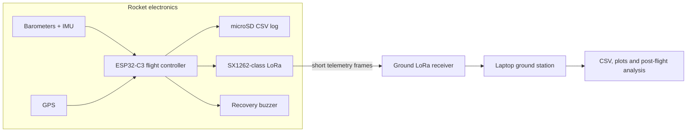

# Rocket Graduator

> A model-rocket flight data logger and recovery-telemetry platform for the LOC Precision Graduator.

Rocket Graduator is an engineering project built around one goal: record useful flight data on board, send a compact live telemetry stream to the ground, and make post-flight recovery easier with GPS data and a buzzer.

It is deliberately **not** a motor, pyrotechnics, or recovery-deployment controller. The electronics stay within the telemetry, logging, tracking, and ground-analysis scope.

## Current stage

The project is in its early engineering and hardware-validation phase.

- the repository is structured around separate rocket, ground, and analysis components;
- an isolated `BME280 + ESP32 WROOM` bench test has compiled successfully during local hardware validation;
- the final ESP32-C3 pin map, radio configuration, and end-to-end flight firmware are still being validated.

That status is intentional: the repository documents the route from verified hardware tests to a reliable integrated system, rather than presenting unfinished modules as a completed flight computer.

## System overview



## Planned hardware

| Area | Current direction |
| --- | --- |
| Flight controller | Compact ESP32-C3 board |
| Altitude | MS5611 as the primary barometer, BME280 as backup/environment sensor |
| Motion | MPU6050 IMU |
| Position | NEO-6M GPS |
| Telemetry | LR30 / SX1262-class LoRa radio |
| Flight record | microSD CSV logging |
| Recovery aid | Active buzzer and last-known GPS coordinates |
| Ground segment | LoRa receiver, ESP32-class board, Python serial ingest and plots |

## Repository layout

```text
firmware_rocket/   Flight-side firmware modules and PlatformIO project
firmware_ground/   Ground receiver firmware and PlatformIO project
ground_station/    Python serial ingest, CSV and visualisation entry point
shared/            Telemetry-frame specification shared by both ends
tests/             Isolated hardware bring-up tests
docs/              Hardware and integration notes
data/              Local flight logs (kept out of source control)
```

## First hardware check: BME280

The first bench validation targets a BME280 connected to an ESP32 WROOM over I2C. Its PlatformIO build has completed successfully; the test source and detailed wiring notes are still being integrated with the active hardware documentation before publication.

The next public milestone is to add that isolated test, its serial output, and a wiring photo to the repository.

## Engineering roadmap

1. Verify the sensor, GPS, LoRa, SD, battery, and buzzer modules independently.
2. Freeze the ESP32-C3 power plan and pin assignment from the actual board, not assumptions.
3. Define and test a compact telemetry frame shared by rocket and ground firmware.
4. Log flight data to CSV and receive live LoRa telemetry on the ground station.
5. Run an end-to-end bench test before any flight use, then inspect recorded data and refine the system.

## Safety boundary

This repository is for data logging, position tracking, and telemetry. It must not be used to control propulsion, pyrotechnics, or recovery deployment. Always test electronics on the bench first and follow local safety and flying-club rules.

## Tech direction

`ESP32` · `PlatformIO` · `C++` · `I2C` · `SPI` · `UART` · `LoRa` · `microSD` · `Python` · `CSV`
